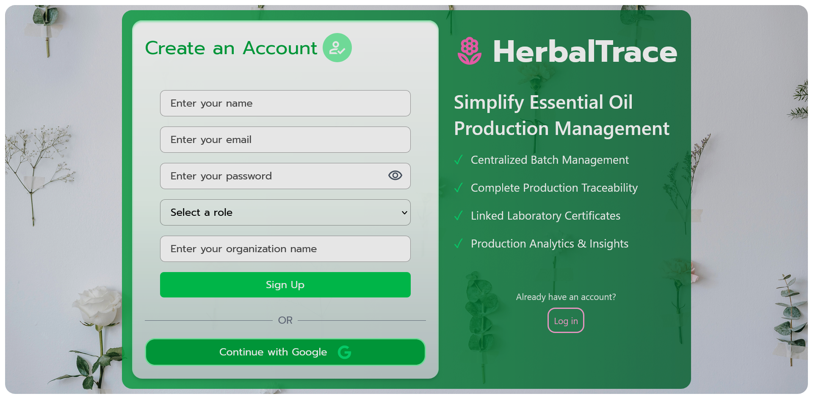

# HerbalTrace

A traceability platform for managing essential oil production batches, linking lab certificates, and tracking dispatches to buyers — with basic analytics to flag irregular yield patterns.

---

## Live Demo

**App:** https://herbal-trace-six.vercel.app

---

## Screenshots

<p align="center">
  
  
</p>

<p align="center">
  
  
</p>

---

## Features

* User authentication with email/password (JWT) and Google OAuth 2.0
* Organization-based multi-user access — users belong to an organization and share its data
* Two role types — **Admin** and **Sales** — with permissions scoped accordingly
* Create, view, update, and manage essential oil production batches
* Link lab certificates to production batches
* Track dispatches to buyers, linked back to source batches
* Yield tracking per batch, with data structured for analysis
* AI-powered insights to flag irregular yield patterns and surface production trends
* Rate-limited authentication endpoints to protect against brute-force attempts

---

## Tech Stack

| Layer      | Technology                                             |
| ---------- | ------------------------------------------------------ |
| Frontend   | React, Vite                                            |
| Backend    | Node.js, Express.js                                    |
| Database   | MongoDB Atlas (Mongoose ODM)                           |
| Auth       | JWT, Passport.js (Google OAuth 2.0), bcryptjs          |
| AI         | OpenRouter API, integrated via backend `/api/ai` route |
| Deployment | Vercel (frontend), Render (backend)                    |

---

## Setup Instructions

### Prerequisites

* Node.js
* MongoDB Atlas account
* Git
* A Google Cloud OAuth Client ID/Secret (for Google login)

### 1. Clone the Repository

```bash
git clone <repository-url>
cd HerbalTrace
```

### 2. Backend Setup

```bash
cd backend
npm install
```

Create a `backend/.env` file:

```env
MONGODB_STRING=your_mongodb_connection_string
JWT_SECRET=your_secret_key
FRONTEND_URL=http://localhost:5173
GOOGLE_CLIENT_ID=your_google_client_id
GOOGLE_CLIENT_SECRET=your_google_client_secret
GOOGLE_CALLBACK_URL=http://localhost:5000/api/auth/google/callback
OPENROUTER_API_KEY=your_openrouter_api_key
```

Run the backend:

```bash
npm run dev
```

Backend runs on:

```text
http://localhost:5000
```

### 3. Frontend Setup

```bash
cd ../frontend
npm install
```

Create a `frontend/.env` file:

```env
VITE_API_URL=http://localhost:5000
```

Run the frontend:

```bash
npm run dev
```

Frontend runs on:

```text
http://localhost:5173
```

### 4. MongoDB Atlas Setup

1. Log in to MongoDB Atlas and create a cluster.
2. Create a database user.
3. Under **Network Access**, allow your IP (or `0.0.0.0/0` for local development).
4. Copy the connection string into `MONGODB_STRING`.

### 5. Google OAuth Setup (Optional)

1. Go to [Google Cloud Console](https://console.cloud.google.com) → **APIs & Services → Credentials**.
2. Create an OAuth 2.0 Client ID.
3. Add `http://localhost:5173` under **Authorized JavaScript origins**.
4. Add `http://localhost:5000/api/auth/google/callback` under **Authorized redirect URIs**.
5. Copy the Client ID and Secret into `backend/.env`.

---

## API Documentation

### Base URLs

**Local:**

```text
http://localhost:5000
```

**Production:**

```text
https://herbaltrace.onrender.com
```

### Auth

#### `POST /api/auth/register`

Create a new user account.

```json
{
  "name": "Jane Doe",
  "email": "jane@example.com",
  "password": "yourpassword",
  "orgName": "Green Fields Co",
  "role": "admin"
}
```

**Response `201`:**

```json
{
  "message": "Signup successful",
  "token": "<jwt>",
  "user": {
    "id": "...",
    "name": "Jane Doe",
    "email": "jane@example.com",
    "role": "admin",
    "organization": "green fields co"
  }
}
```

#### `POST /api/auth/login`

Authenticate an existing user.

```json
{
  "email": "jane@example.com",
  "password": "yourpassword"
}
```

**Response `200`:**

```json
{
  "message": "Login successful",
  "token": "<jwt>",
  "user": {
    "id": "...",
    "name": "Jane Doe",
    "email": "jane@example.com",
    "role": "admin",
    "organization": "green fields co"
  }
}
```

#### `GET /api/auth/google`

Redirects the user to Google's OAuth consent screen.

#### `GET /api/auth/google/callback`

Google redirects here after consent. On success, the user is redirected to the frontend with a JWT:

```text
/oauth-success?token=...
```

For new users, the flow redirects to:

```text
/complete-profile?token=...
```

#### `POST /api/auth/complete-profile`

Completes registration for a new Google-signup user. Requires the temporary token from the callback redirect, sent as a Bearer token.

```json
{
  "orgName": "Green Fields Co",
  "role": "admin"
}
```

**Response `200`:**

```json
{
  "message": "Registration complete",
  "token": "<jwt>",
  "user": {
    "id": "...",
    "name": "...",
    "email": "...",
    "role": "admin",
    "organization": "green fields co"
  }
}
```

### Batches

| Method   | Endpoint       | Description                                                | Auth     |
| -------- | -------------- | ---------------------------------------------------------- | -------- |
| `GET`    | `/batches`     | List all batches for the authenticated user's organization | Required |
| `POST`   | `/batches`     | Create a new production batch                              | Required |
| `GET`    | `/batches/:id` | Get details of a single batch                              | Required |
| `PUT`    | `/batches/:id` | Update a batch                                             | Required |
| `DELETE` | `/batches/:id` | Delete a batch                                             | Required |

All batch routes are protected by authentication middleware and scoped to the authenticated user's organization.

### AI

#### `POST /api/ai`

Submit batch/yield data and receive AI-generated insights, including irregular yield pattern flags and production trends.

**Authentication:** Required.

### User

#### `GET /user`

Returns the authenticated user's profile and organization information.

**Authentication:** Required.

---

## Architecture / Folder Structure

```text
HerbalTrace/
├── backend/
│   ├── config/          # Passport / OAuth strategy config
│   ├── middleware/      # Auth middleware, rate limiter, error handler
│   ├── models/          # Mongoose schemas
│   ├── routes/          # Express route handlers
│   ├── validators/      # Request validation schemas (Zod)
│   ├── server.js        # App entry point
│   └── package.json
│
├── frontend/
│   ├── src/
│   │   ├── pages/       # Route-level components
│   │   ├── components/  # Reusable UI components
│   │   └── ...
│   ├── vercel.json      # SPA rewrite rules
│   └── package.json
│
├── screenshots/
│   ├── signup.png
│   ├── dashboard.png
│   ├── batches.png
│   ├── ai-insights.png
│   └── database-schema.png
│
└── README.md
```

### Data Model

An `Organization` has many `User`s, `Batch`es, and `Dispatch`es. Each `Batch` can have multiple linked `Dispatch` records.

Authentication is JWT-based, with organization scoping enforced server-side so users only access data belonging to their organization.

### Database Schema

<p align="center">
  
</p>

---

## Known Limitations

* **Render free tier spins down after 15 minutes of inactivity** — the first request after idle can take 30–60 seconds to wake the server.
* **MongoDB Atlas network access is set to `0.0.0.0/0`** since Render's free tier does not provide fixed outbound IPs; database access is still protected by database authentication.
* OAuth tokens are currently passed via URL query parameters on redirect rather than httpOnly cookies — functional, but not the most hardened production pattern.
* No automated test suite yet.
* No pagination on batch/dispatch list endpoints yet — acceptable for demo data volumes, but would need to be addressed at scale.

---

## Credits & Acknowledgements

This project was developed as part of the **Summer Internship Programme 2026 (SIP 2026)** under the **AI-Assisted Full Stack Web Development** track at the **Technology Business Incubator, Graphic Era University (TBI-GEU)**.

Sincere thanks to:

* **Technology Business Incubator, Graphic Era University (TBI-GEU)** for the opportunity to participate in SIP 2026 and for exposure to industry-oriented software development practices.
* **Mr. Swarn Shauryam Swarnkar**, Program Coordinator, TBI-GEU SIP 2026, for efficient coordination, timely communication, and continuous support throughout the programme.
* The entire **TBI-GEU team** for regular review of weekly deliverables and constructive feedback that contributed to the successful completion of this project.
* **Ms. Sarishma Dangi**, Chief Executive Officer, TBI-GEU, for providing an industry-oriented learning environment bridging academic education and professional software development.
* The **Department of Computer Science and Engineering, Graphic Era (Deemed to be University), Dehradun**, for encouraging participation in industrial interactions and enabling this practical experience.

### Tools Used

* **Claude (Anthropic)** as an AI assistant for debugging deployment issues, including CORS, environment variables, OAuth redirect configuration, and MongoDB Atlas network access, and for assisting with documentation.
* Deployed using [Vercel](https://vercel.com) and [Render](https://render.com).
* Database hosted on [MongoDB Atlas](https://www.mongodb.com/atlas).
